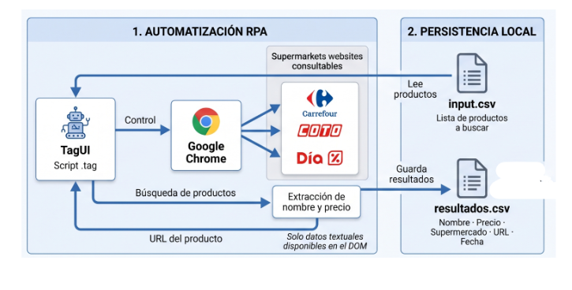

# 🛒 UTN FRCU – Tecnologías para la Automatización
## RPA Supermercados: Comparador y Extractor de Precios con TagUI

Automatización robótica de procesos (RPA) desarrollada en **TagUI** para consultar y comparar precios de una canasta de productos en los principales supermercados de Argentina: **Carrefour**, **COTO Digital** y **Día %**.

---

## 📌 Descripción del Proyecto

El bot automatiza la búsqueda periódica de productos comestibles y de limpieza para monitoreo de precios. 

A partir de un archivo de entrada con productos requeridos (`input.csv`), el robot interactúa con el navegador **Google Chrome**, realiza las búsquedas correspondientes en cada cadena de supermercados, extrae los datos del producto más relevante directamente del árbol DOM y persiste los hallazgos en un archivo local consolidado (`resultados.csv`).

### 🏛️ Diagrama de Arquitectura
El flujo implementado responde exactamente al modelo funcional de la cátedra:



1. **Automatización RPA**:
   - **TagUI (`scraper_supermercados.tag`)**: Motor de orquestación y navegación.
   - **Google Chrome**: Control de la sesión web.
   - **Websites Consultados**:
     - 🔵 **Carrefour Argentina** (`carrefour.com.ar`)
     - 🔴 **COTO Digital** (`cotodigital3.com.ar`)
     - 🔴 **Día %** (`diaonline.supermercadosdia.com.ar`)
   - **Extracción DOM**: Recolección textual de *Nombre*, *Precio*, *URL* y fecha de relevamiento.
2. **Persistencia Local**:
   - **`input.csv`**: Lista de productos a consultar (uno por fila).
   - **`resultados.csv`**: Tabla de resultados estructurada.

---

## 📂 Estructura de Archivos

```plaintext
rpa tagui super/
│
├── estructura.png             # Diagrama de arquitectura del flujo RPA
├── input.csv                  # Archivo de entrada con la lista de productos
├── resultados.csv             # Archivo generado con los datos extraídos
├── scraper_supermercados.tag  # Script principal de TagUI
├── tagui_local.js             # Funciones auxiliares JS (fechas, sanitizado CSV)
├── ejecutar.bat               # Lanzador por doble clic en Windows
└── README.md                  # Documentación del proyecto
```

---

## 📊 Formato de Datos

### 1. Entrada (`input.csv`)
Archivo CSV simple con cabecera `producto`:

```csv
producto
leche
arroz
fideos
yerba mate
aceite
```

### 2. Salida (`resultados.csv`)
Archivo CSV generado automáticamente con cabeceras estándar:

```csv
Nombre,Precio,Supermercado,URL,Fecha
"Leche Entera Larga Vida 1 L","$ 1.250,00","Carrefour","https://...","11/09/2026"
"Leche Ultrapasteurizada Entera 1 L","$ 1.190,00","COTO","https://...","11/09/2026"
"Leche Parcialmente Descremada 1 L","$ 1.150,00","Día %","https://...","11/09/2026"
...
```

---

## 🛠️ Instalación y Requisitos

1. **Google Chrome**: Asegurarse de tener instalado el navegador Google Chrome.
2. **TagUI**:
   - Descargar la última versión desde el repositorio oficial: [TagUI Releases](https://github.com/aisingapore/TagUI/releases).
   - Descomprimir el archivo `.zip` en una carpeta permanente (por ejemplo: `C:\tagui`).
   - Agregar la ruta de la carpeta `src` (ejemplo: `C:\tagui\src`) a la variable de entorno `PATH` de Windows.
   - Para verificar la instalación, abrir una terminal (PowerShell o CMD) y ejecutar:
     ```cmd
     tagui
     ```
     Deberá mostrar las opciones de ayuda del framework.

---

## 🚀 Instrucciones de Uso

### Opción A: Mediante el archivo ejecutable (Recomendado)
Simplemente hacer doble clic sobre el archivo:
```
ejecutar.bat
```
El script verificará el entorno y lanzará la automatización visual en Chrome mostrando el progreso en consola.

### Opción B: Mediante línea de comandos (CLI)
Abrir una terminal en el directorio del proyecto y ejecutar:

```bash
# Modo visual normal
tagui scraper_supermercados.tag input.csv

# Modo headless (navegador invisible en segundo plano)
tagui scraper_supermercados.tag input.csv -headless

# Modo con reporte detallado
tagui scraper_supermercados.tag input.csv -report
```

---

## ⚙️ Decisiones Técnicas y Robustez

- **Extracción Híbrida DOM + JS**: Dado que las plataformas de comercio electrónico (como VTEX en Carrefour y Día) actualizan con frecuencia sus atributos CSS y nombres de clase dinámicos, la extracción se implementó mediante bloques `dom return (function() { ... })()`. Esto permite evaluar múltiples selectores de contingencia en JavaScript puro, garantizando que el bot no falle ante variaciones mínimas de diseño.
- **Manejo de Modales de Ubicación**: Se implementaron rutinas no bloqueantes en JavaScript para detectar y cerrar automáticamente los avisos de código postal / sucursal y avisos de cookies.
- **Sanitización de Datos CSV**: En `tagui_local.js` se incluyen utilidades para escapar comillas dobles (`"`), eliminar saltos de línea internos y normalizar espacios en blanco, evitando que el archivo `resultados.csv` sufra desalineaciones de columnas.
